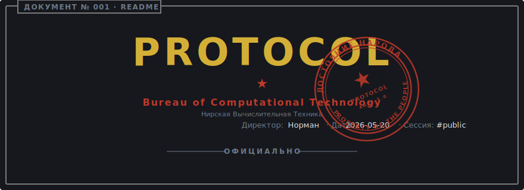

<!-- markdownlint-disable MD041 -->

<p align="center">
  <a href="README.pt-br.md">
    
  </a>
</p>

<p align="center">
  <a href="https://github.com/niltonfrederico/glory-to-protocol/actions/workflows/ci.yml"></a>
  <a href="https://pypi.org/project/glory-to-protocol/"></a>
  <a href="https://pypi.org/project/glory-to-protocol/"></a>
  <a href="LICENSE"></a>
</p>

<p align="center">
  
</p>

## СВОДКА · TL;DR

A Python TUI library for [Typer](https://typer.tiangolo.com/) CLIs that
wraps your commands in a deadpan, state-bureau aesthetic — framed forms,
four decision stamps (`approve` / `reject` / `order` / `review`), themed
`--help`, an ASCII logo header, and a live ticker for background jobs.
Built because useful tools and funny tools rarely overlap.

<p align="center">
  
</p>

## ОГЛАВЛЕНИЕ · Index

- [СВОДКА · TL;DR](#%D1%81%D0%B2%D0%BE%D0%B4%D0%BA%D0%B0--tldr)
- [ОГЛАВЛЕНИЕ · Index](#%D0%BE%D0%B3%D0%BB%D0%B0%D0%B2%D0%BB%D0%B5%D0%BD%D0%B8%D0%B5--index)
- [ПОЛЕ № 1 · Purpose](#%D0%BF%D0%BE%D0%BB%D0%B5--1--purpose)
- [ПОЛЕ № 2 · Installation](#%D0%BF%D0%BE%D0%BB%D0%B5--2--installation)
  - [pip](#pip)
  - [uv](#uv)
  - [poetry](#poetry)
- [ПОЛЕ № 3 · Usage](#%D0%BF%D0%BE%D0%BB%D0%B5--3--usage)
  - [Configuration](#configuration)
  - [Typer CLI integration](#typer-cli-integration)
  - [Components](#components)
    - [Form](#form)
    - [Logo](#logo)
    - [Palette](#palette)
    - [Wrap](#wrap)
    - [Stamps](#stamps)
  - [Background jobs](#background-jobs)
- [ПОЛЕ № 4 · Status & Roadmap](#%D0%BF%D0%BE%D0%BB%D0%B5--4--status--roadmap)
- [ОТКАЗ · Disclaimer](#%D0%BE%D1%82%D0%BA%D0%B0%D0%B7--disclaimer)
- [ВКЛАД · Contributing](CONTRIBUTING.md)
  - [Для граждан повышенного допуска · For citizens of elevated clearance](TRUE_CONTRIBUTING.md)
- [КОДЕКС · Code of Conduct](CODE_OF_CONDUCT.md)
  - [Для граждан повышенного допуска · For citizens of elevated clearance](TRUE_CODE_OF_CONDUCT.md)
- [ЛИЦЕНЗИЯ · License](LICENSE)

## ПОЛЕ № 1 · Purpose

A Python TUI library for [Typer](https://typer.tiangolo.com/) CLIs —
forms with framed borders, four kinds of decision stamps (`approve` /
`reject` / `order` / `review`), a themed `--help` renderer, an ASCII logo
header, and a live ticker for background jobs. The library ships a
`ProtocolTyper` subclass and `make_app()` helper so the bureau frame
shows up on every command and sub-app without extra wiring; see
[Typer CLI integration](#typer-cli-integration) below.

I built this because I kept reaching for libraries that were either *useful*
or *fun*, and rarely both. I wanted my own CLIs to feel like an artifact —
printing `REJECTED` with a timestamp instead of `Error: invalid input`. The
fact that it doubles as a perfectly serviceable TUI toolkit is a side effect.

The aesthetic — Cyrillic accents, bureau titles, deadpan stamps — landed
where it did because I'd been deep into Papers, Please at the time. The lib
doesn't reuse a line of code or any asset from that game (see the
[disclaimer](#%D0%BE%D1%82%D0%BA%D0%B0%D0%B7--disclaimer)), but the vibe is unmistakably from the
same shelf.

A note on the Russian: I speak some, and a few terms here are bent on
purpose for the bureau-comic effect, but I'm nowhere near a native speaker.
If anything reads as accidentally wrong — or, worse, accidentally offensive
— please [open an issue](https://github.com/niltonfrederico/glory-to-protocol/issues/new)
and I'll fix it.

## ПОЛЕ № 2 · Installation

### pip

```bash
pip install glory-to-protocol
```

### uv

```bash
uv add glory-to-protocol
```

### poetry

```bash
poetry add glory-to-protocol
```

## ПОЛЕ № 3 · Usage

### Configuration

The library exposes a single `ProtocolSettings` singleton that holds every
piece of bureau-level branding. Defaults render the NIRVYTEKH look out of the
box; override them when wiring the lib into your own CLI.

| Field | Default | Effect |
| -------------------- | --------------------------------------------------------- | ------------------------------------------------------- |
| `app_name` | `"Protocol"` | Generic application name (used as fallback). |
| `logo_text` | `"Protocol"` | Text rendered as the large ASCII logo (header). |
| `small_logo_text` | `"Protocol"` | Text rendered inside the small bordered logo (stamps). |
| `bureau_title` | `"БЮРО NIRVYTEKH · Bureau of Computational Technology"` | Subtitle line under the large logo in the header. |
| `director_name` | `"Норман"` | Director name shown in the header meta row. |
| `director_signature` | `"Подписано: Норман, Директор NIRVYTEKH"` | Signature line at the form footer. |
| `ascii.allowed_alphabet` | uppercase A–Z, 0–9 | Characters allowed in `logo_text` / `small_logo_text`. |

`logo_text` is validated against `ascii.allowed_alphabet` — passing characters
outside the set raises `InvalidASCIICharactersError`.

#### Programmatic override (recommended)

Use `configure(**overrides)` at startup, before any component renders. This is
the canonical coupling point when embedding the lib into your own Typer CLI.

```python
import typer
from glory_to_protocol import configure, make_app

configure(
    app_name="MyBureau",
    logo_text="MyBureau",
    small_logo_text="MyBureau",
    director_name="Ada Lovelace",
    director_signature="Signed: Ada Lovelace, Director",
)

app: typer.Typer = make_app()
```

Calls layer: each `configure()` updates only the fields you pass; unspecified
fields keep their value. For tests, `reset_settings()` clears the singleton.

### Typer CLI integration

The lib ships a `ProtocolTyper` subclass and a `make_app()` helper that wire
the bureau's themed `--help` renderer into every command and sub-app. See
[examples/showcase.py](examples/showcase.py) for the full reference.

```python
import typer
from glory_to_protocol import configure, make_app
from glory_to_protocol.tui.forms import Form

configure(app_name="MyBureau", logo_text="MyBureau", small_logo_text="MyBureau")

app = make_app()


@app.command()
def status() -> None:
    with Form(title="status") as form:
        form.line("All systems nominal.")
```

Reference points in [examples/showcase.py](examples/showcase.py):

- Typer app + subcommand registration loop:
  [examples/showcase.py:150](examples/showcase.py#L150) and
  [examples/showcase.py:165-173](examples/showcase.py#L165-L173)
- Single-shot run helper (Console + Form + optional save):
  [examples/showcase.py:122](examples/showcase.py#L122)
- Composing components inside a Form:
  [examples/showcase.py:109](examples/showcase.py#L109)

### Components

#### `Form`

Context manager that draws the bureau form frame (top border, header,
divider, body, signature, bottom border). Every other component renders into
a `Form`.

```python
from glory_to_protocol.tui.forms import Form

with Form(title="version") as form:
    form.line("Consulting bureau records...")
```

Constructor parameters:

| Param | Type | Default | Purpose |
| ---------------- | ---------------- | ------- | -------------------------------------------------------- |
| `title` | `str` | — | Tab label on the top border (e.g., `"version"`). |
| `console` | `Console \| None`| `None` | Inject a Rich `Console`; auto-created if omitted. |
| `show_header` | `bool` | `True` | Render the large logo + bureau title block at the top. |
| `signature_text` | `str \| None` | `None` | Override the footer signature; defaults to settings. |

Methods: `line(text, style=None, *, wrap=True)`, `divider()`, `stamp(...)`,
`run_pending(jobs)`.

#### Logo

<p align="center">
  
</p>

Two ASCII logo renderers driven by `logo_text` and `small_logo_text`:

```python
from glory_to_protocol.tui.logo import logo_large, logo_small

print(logo_large())            # uses settings.logo_text
print(logo_small("ARCHIVE"))   # explicit override
```

Both accept an optional `text: str | None`; passing `None` reads the current
settings. Results are memoized — `configure()` invalidates the cache.

#### Palette

<p align="center">
  
</p>

The `theme` module exposes named Rich `Style` objects for consistent
typography across components:

```python
from glory_to_protocol.tui import theme

form.line("Default report body.", style=theme.BODY)
form.line("Side note.", style=theme.MUTED)
form.line("Official accent.", style=theme.CYRILLIC_ACCENT)
form.line("Footer signature.", style=theme.SIGNATURE)
```

Other roles in the palette: `theme.HEADER`, `theme.BORDER`,
`theme.STAMP_APPROVE`, `theme.STAMP_REJECT`, `theme.STAMP_ORDER`,
`theme.STAMP_REVIEW`.

#### Wrap

<p align="center">
  
</p>

`Form.line(text)` cell-wraps to the form's inner width, handling Latin,
Cyrillic, and mixed-alphabet content correctly. Pass `wrap=False` to disable
wrapping (the line is then truncated to fit):

```python
form.line(long_text)                # default: wrap to inner width
form.line(long_text, wrap=False)    # truncate to one line
```

#### Stamps

<p align="center">
  
</p>

Four stamp variants encode the bureau's terminal decisions on a request.
Each takes a required `label` and an optional `detail`:

```python
from glory_to_protocol.tui.stamps import (
    stamp_approve, stamp_reject, stamp_order, stamp_review,
)

form.stamp(stamp_approve("Q2 budget", "audit clean"))
form.stamp(stamp_reject("request #4711", "out of bureau scope"))
form.stamp(stamp_order("team 3 mobilization", "immediate execution"))
form.stamp(stamp_review("monthly report", "awaiting Gensek review"))
```

| Variant | Label (RU/EN) | Use for |
| ---------------- | --------------------------- | ------------------------------------------------------ |
| `stamp_approve` | `ОДОБРЕНО / APPROVED` | Request granted, action complete. |
| `stamp_reject` | `ОТКАЗАНО / REJECTED` | Request denied; include `detail` with the reason. |
| `stamp_order` | `ПРИКАЗ / DIRECT ORDER` | Imperative — the bureau is dictating an action. |
| `stamp_review` | `К СВЕДЕНИЮ / FOR REVIEW` | Awaiting external decision (e.g., from the Gensek). |

Signature: `stamp_<variant>(label: str, detail: str = "") -> Table`.

### Background jobs

<p align="center">
  
</p>

`Form.run_pending(jobs)` fans out a list of `Job`s as async tasks and renders
a live ticker until all reach a terminal state. Failures in one job are
isolated — siblings keep running.

```python
import asyncio
from glory_to_protocol.jobs.types import Job

async def fetch_quota() -> None:
    await asyncio.sleep(2)

jobs = [
    Job(label="fetching quota", coro_factory=fetch_quota),
    Job(label="archiving ledger", coro_factory=lambda: asyncio.sleep(3)),
]

with Form(title="sync") as form:
    form.line("Reconciling with the bureau...", style=theme.MUTED)
    outcomes = asyncio.run(form.run_pending(jobs))

for outcome in outcomes:
    print(outcome.label, outcome.status, outcome.duration_ms)
```

`Job` fields:

| Field | Type | Default | Purpose |
| -------------- | --------------------------------- | ------- | -------------------------------------------------- |
| `label` | `str` | — | Shown in the live ticker. |
| `coro_factory` | `Callable[[], Awaitable[None]]` | — | Factory that returns the coroutine to await. |
| `critical` | `bool` | `False` | Tag-only today; reserved for future fail-fast use. |

`coro_factory` is a **factory**, not a coroutine — passing the coroutine
directly would bind it to the wrong event loop. Wrap with a `lambda` or a
`def` that returns the awaitable. Each job receives a fresh awaitable on
spawn.

Outcomes returned by `run_pending`:

| Field | Type | Meaning |
| ------------- | ------------------------------- | ---------------------------------------------- |
| `label` | `str` | Echoes `Job.label`. |
| `status` | `"ok" \| "fail" \| "skipped"` | Terminal state. `"skipped"` only set by `PipelineRunner` for unreached jobs. |
| `error` | `BaseException \| None` | The exception, if `status == "fail"`. |
| `duration_ms` | `int` | Wall-clock duration of the job. |

The runner never raises on individual job failure; the caller decides how a
failed background job affects the foreground stamp.

#### Callbacks (per-job, fan-out)

`JobRunner.spawn` takes three optional per-job hooks:

| Kwarg | Fires when | Signature |
| ------------ | -------------------- | ------------------------------------------ |
| `rollback` | job ends in `fail` | `async (outcome: JobOutcome) -> None` |
| `on_success` | job ends in `ok` | `async (outcome: JobOutcome) -> None` |
| `timeout` | wall-clock cap (s) | `float` |

`rollback` and `on_success` are mutually exclusive in practice — only one runs
per job. Cancellation skips both. If a callback itself raises, the error is
logged and swallowed so it cannot mask the original outcome or break sibling
isolation.

`timeout` wraps the job's coroutine in `asyncio.wait_for`; an expired timeout
produces a `fail` outcome with a `TimeoutError`, which then triggers
`rollback` like any other failure.

```python
from glory_to_protocol.jobs import Job, JobOutcome, JobRunner


async def write_temp_file() -> None: ...
async def remove_temp_file(outcome: JobOutcome) -> None: ...
async def audit(outcome: JobOutcome) -> None: ...


async with JobRunner() as runner:
    runner.spawn(
        Job("stage temp file", write_temp_file),
        rollback=remove_temp_file,
        on_success=audit,
        timeout=5.0,
    )
```

#### Runner safeguards

Both `JobRunner` and `PipelineRunner` accept two ctor kwargs that bound
fan-out and protect against callback-induced recursion:

| Kwarg | Default | Effect |
| --------------- | --------- | --------------------------------------------------------------------- |
| `max_children` | `12` | Cap on jobs registered via `spawn`. `0` disables the cap (unbounded). Exceeding always raises (programmer error). |
| `on_recursion` | `"raise"` | `spawn` called after the context starts closing (e.g. from inside a callback) raises. `"warn"` logs and returns a synthetic `"skipped"` handle that is not enrolled. |

```python
runner = JobRunner(max_children=0, on_recursion="warn")
```

#### Pipelines (sequential, transactional)

`PipelineRunner` is the sequential counterpart to `JobRunner`. Jobs registered
with `spawn` execute in order on context exit; the first failure aborts the
pipeline, triggers LIFO rollback of previously-completed jobs, marks the
unreached jobs as `"skipped"`, and re-raises as `PipelineFailed`.

```python
from glory_to_protocol.jobs import Job, JobOutcome, PipelineFailed, PipelineRunner


async def reserve_quota() -> None: ...
async def write_ledger() -> None: ...
async def notify_director() -> None: ...

async def release_quota(o: JobOutcome) -> None: ...
async def revert_ledger(o: JobOutcome) -> None: ...

try:
    async with PipelineRunner() as p:
        p.spawn(Job("reserve quota", reserve_quota), rollback=release_quota)
        p.spawn(Job("write ledger", write_ledger), rollback=revert_ledger)
        p.spawn(Job("notify director", notify_director))
except PipelineFailed as exc:
    print(exc.failed.label, exc.rolled_back, exc.rollback_errors)
```

Semantics:

- **Order.** Jobs run in the order they were `spawn`ed.
- **Abort.** On first failure, no subsequent job runs; remaining handles
  flip to `"skipped"`.
- **LIFO rollback.** Successfully-completed jobs have their rollback invoked
  in reverse order. Rollback errors are logged and collected in
  `PipelineFailed.rollback_errors`; the chain continues regardless.
- **First-job failure.** Nothing to undo — `rolled_back` is empty.
- **Body exception.** If the `async with` body raises before exit, no job
  runs and the body's exception propagates unchanged.

`PipelineFailed` exposes `.failed` (the failed `JobOutcome`), `.rolled_back`
(labels rolled back, LIFO order), and `.rollback_errors`
(`list[tuple[str, BaseException]]`).

## ПОЛЕ № 4 · Status & Roadmap

**Beta (0.1.1).** The public surface — `Form`, the four stamps, `logo_large` / `logo_small`, `theme`, `configure()`, `Job` / `run_pending`, `JobRunner` + `PipelineRunner` (with per-job `rollback`, `on_success`, `timeout`, `max_children`, and `on_recursion` policy), and `ProtocolTyper` / `make_app` — is stable enough to drive a real CLI (112 tests, ~98% coverage). Minor versions may still refine APIs before 1.0.

Planned:

- Long-running jobs (progress reporting, cancellation surface)
- Better tracebacks (themed, framed inside the bureau form)
- Custom component authoring (public composition API)
- Sentient Rubber Duck (Да, really)
- Interactive TUI

Want a favor from the Верховный Лидер (Supreme Leader)? [Open an issue](https://github.com/niltonfrederico/glory-to-protocol/issues/new).

## ОТКАЗ · Disclaimer

This project's visual and thematic aesthetic is loosely inspired by
[Papers, Please](https://papersplea.se/) (© Lucas Pope / 3909 LLC), specifically
its evocation of a fictional Eastern-Bloc-style state bureau.

The inspiration is atmospheric only. **Glory to Protocol does not use, reference,
or distribute any code, asset, artwork, character, name, country, or
trademark from Papers, Please.** No content from Arstotzka — or any other
fictional element of the game — appears in this repository. The bureau, its
naming, its symbols, and its language are original to this project.

Papers, Please and Arstotzka are property of their respective owners. This
project is not affiliated with, endorsed by, or sponsored by Lucas Pope or
3909 LLC.

If this project's atmosphere resonates with you, please consider supporting the
original creator by buying Papers, Please on its
[official site](https://papersplea.se/) or your preferred storefront. The work
that inspired this aesthetic deserves to be paid for.
