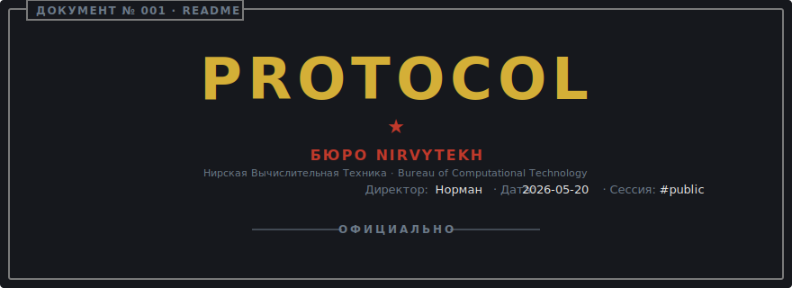

# glory-to-protocol

<p align="center">
  
</p>

## ПОЛЕ № 1 · Purpose

_TBD_

## ПОЛЕ № 2 · Installation

_TBD_

## ПОЛЕ № 3 · Usage

_TBD_

## ПОЛЕ № 4 · Layout

_TBD_

## ПОЛЕ № 5 · Status

_TBD_

```text
                ╔═══════════╗   ОДОБРЕНО / APPROVED
                ║  Protocol ║   README · public release
                ╚═══════════╝   2026-05-20 UTC
```
