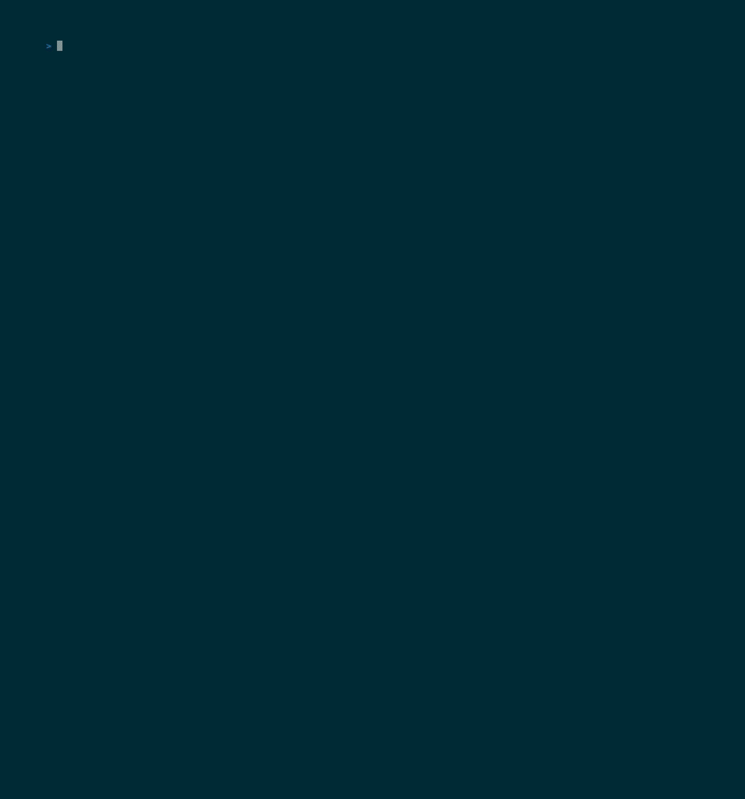

<!-- markdownlint-disable MD041 -->
<p align="center">
  
</p>

## СВОДКА · TL;DR

<p align="center">
  
</p>

## ОГЛАВЛЕНИЕ · Index

- [СВОДКА · TL;DR](#сводка--tldr)
- [ОГЛАВЛЕНИЕ · Index](#оглавление--index)
- [ПОЛЕ № 1 · Purpose](#поле--1--purpose)
- [ПОЛЕ № 2 · Installation](#поле--2--installation)
  - [pip](#pip)
  - [uv](#uv)
  - [poetry](#poetry)
- [ПОЛЕ № 3 · Usage](#поле--3--usage)
  - [Configuration](#configuration)
  - [Typer CLI integration](#typer-cli-integration)
  - [Components](#components)
    - [Form](#form)
    - [Logo](#logo)
    - [Palette](#palette)
    - [Wrap](#wrap)
    - [Stamps](#stamps)
  - [Background jobs](#background-jobs)
- [ПОЛЕ № 4 · Layout](#поле--4--layout)
- [ПОЛЕ № 5 · Status](#поле--5--status)
- [ПОЛЕ № 6 · Roadmap](#поле--6--roadmap)
- [ОТКАЗ · Disclaimer](#отказ--disclaimer)
- [ВКЛАД · Contributing](CONTRIBUTING.md)
- [ЛИЦЕНЗИЯ · License](LICENSE)

## ПОЛЕ № 1 · Purpose

_TBD_

## ПОЛЕ № 2 · Installation

### pip

```bash
pip install glory-to-protocol
```

### uv

```bash
uv add glory-to-protocol
```

### poetry

```bash
poetry add glory-to-protocol
```

## ПОЛЕ № 3 · Usage

### Configuration

The library exposes a single `ProtocolSettings` singleton that holds every
piece of bureau-level branding. Defaults render the NIRVYTEKH look out of the
box; override them when wiring the lib into your own CLI.

| Field                | Default                                                   | Effect                                                  |
| -------------------- | --------------------------------------------------------- | ------------------------------------------------------- |
| `app_name`           | `"Protocol"`                                              | Generic application name (used as fallback).            |
| `logo_text`          | `"Protocol"`                                              | Text rendered as the large ASCII logo (header).         |
| `small_logo_text`    | `"Protocol"`                                              | Text rendered inside the small bordered logo (stamps).  |
| `bureau_title`       | `"БЮРО NIRVYTEKH · Bureau of Computational Technology"`   | Subtitle line under the large logo in the header.       |
| `director_name`      | `"Норман"`                                                | Director name shown in the header meta row.             |
| `director_signature` | `"Подписано: Норман, Директор NIRVYTEKH"`                 | Signature line at the form footer.                      |
| `ascii.allowed_alphabet` | uppercase A–Z, 0–9                                    | Characters allowed in `logo_text` / `small_logo_text`.  |

`logo_text` is validated against `ascii.allowed_alphabet` — passing characters
outside the set raises `InvalidASCIICharactersError`.

#### Programmatic override (recommended)

Use `configure(**overrides)` at startup, before any component renders. This is
the canonical coupling point when embedding the lib into your own Typer CLI.

```python
import typer
from glory_to_protocol import configure, make_app

configure(
    app_name="MyBureau",
    logo_text="MyBureau",
    small_logo_text="MyBureau",
    director_name="Ada Lovelace",
    director_signature="Signed: Ada Lovelace, Director",
)

app: typer.Typer = make_app()
```

Calls layer: each `configure()` updates only the fields you pass; unspecified
fields keep their value. For tests, `reset_settings()` clears the singleton.

### Typer CLI integration

The lib ships a `ProtocolTyper` subclass and a `make_app()` helper that wire
the bureau's themed `--help` renderer into every command and sub-app. See
[examples/showcase.py](examples/showcase.py) for the full reference.

```python
import typer
from glory_to_protocol import configure, make_app
from glory_to_protocol.tui.forms import Form

configure(app_name="MyBureau", logo_text="MyBureau", small_logo_text="MyBureau")

app = make_app()


@app.command()
def status() -> None:
    with Form(title="status") as form:
        form.line("All systems nominal.")
```

Reference points in [examples/showcase.py](examples/showcase.py):

- Typer app + subcommand registration loop:
  [examples/showcase.py:150](examples/showcase.py#L150) and
  [examples/showcase.py:165-173](examples/showcase.py#L165-L173)
- Single-shot run helper (Console + Form + optional save):
  [examples/showcase.py:122](examples/showcase.py#L122)
- Composing components inside a Form:
  [examples/showcase.py:109](examples/showcase.py#L109)

### Components

#### `Form`

Context manager that draws the bureau form frame (top border, header,
divider, body, signature, bottom border). Every other component renders into
a `Form`.

```python
from glory_to_protocol.tui.forms import Form

with Form(title="version") as form:
    form.line("Consulting bureau records...")
```

Constructor parameters:

| Param            | Type             | Default | Purpose                                                  |
| ---------------- | ---------------- | ------- | -------------------------------------------------------- |
| `title`          | `str`            | —       | Tab label on the top border (e.g., `"version"`).         |
| `console`        | `Console \| None`| `None`  | Inject a Rich `Console`; auto-created if omitted.        |
| `show_header`    | `bool`           | `True`  | Render the large logo + bureau title block at the top.   |
| `signature_text` | `str \| None`    | `None`  | Override the footer signature; defaults to settings.     |

Methods: `line(text, style=None, *, wrap=True)`, `divider()`, `stamp(...)`,
`run_pending(jobs)`.

#### Logo

<p align="center">
  
</p>

Two ASCII logo renderers driven by `logo_text` and `small_logo_text`:

```python
from glory_to_protocol.tui.logo import logo_large, logo_small

print(logo_large())            # uses settings.logo_text
print(logo_small("ARCHIVE"))   # explicit override
```

Both accept an optional `text: str | None`; passing `None` reads the current
settings. Results are memoized — `configure()` invalidates the cache.

#### Palette

<p align="center">
  
</p>

The `theme` module exposes named Rich `Style` objects for consistent
typography across components:

```python
from glory_to_protocol.tui import theme

form.line("Default report body.", style=theme.BODY)
form.line("Side note.", style=theme.MUTED)
form.line("Official accent.", style=theme.CYRILLIC_ACCENT)
form.line("Footer signature.", style=theme.SIGNATURE)
```

Other roles in the palette: `theme.HEADER`, `theme.BORDER`,
`theme.STAMP_APPROVE`, `theme.STAMP_REJECT`, `theme.STAMP_ORDER`,
`theme.STAMP_REVIEW`.

#### Wrap

<p align="center">
  
</p>

`Form.line(text)` cell-wraps to the form's inner width, handling Latin,
Cyrillic, and mixed-alphabet content correctly. Pass `wrap=False` to disable
wrapping (the line is then truncated to fit):

```python
form.line(long_text)                # default: wrap to inner width
form.line(long_text, wrap=False)    # truncate to one line
```

#### Stamps

<p align="center">
  
</p>

Four stamp variants encode the bureau's terminal decisions on a request.
Each takes a required `label` and an optional `detail`:

```python
from glory_to_protocol.tui.stamps import (
    stamp_approve, stamp_reject, stamp_order, stamp_review,
)

form.stamp(stamp_approve("Q2 budget", "audit clean"))
form.stamp(stamp_reject("request #4711", "out of bureau scope"))
form.stamp(stamp_order("team 3 mobilization", "immediate execution"))
form.stamp(stamp_review("monthly report", "awaiting Gensek review"))
```

| Variant          | Label (RU/EN)               | Use for                                                |
| ---------------- | --------------------------- | ------------------------------------------------------ |
| `stamp_approve`  | `ОДОБРЕНО / APPROVED`       | Request granted, action complete.                      |
| `stamp_reject`   | `ОТКАЗАНО / REJECTED`       | Request denied; include `detail` with the reason.      |
| `stamp_order`    | `ПРИКАЗ / DIRECT ORDER`     | Imperative — the bureau is dictating an action.        |
| `stamp_review`   | `К СВЕДЕНИЮ / FOR REVIEW`   | Awaiting external decision (e.g., from the Gensek).    |

Signature: `stamp_<variant>(label: str, detail: str = "") -> Table`.

### Background jobs

<p align="center">
  
</p>

`Form.run_pending(jobs)` fans out a list of `Job`s as async tasks and renders
a live ticker until all reach a terminal state. Failures in one job are
isolated — siblings keep running.

```python
import asyncio
from glory_to_protocol.jobs.types import Job

async def fetch_quota() -> None:
    await asyncio.sleep(2)

jobs = [
    Job(label="fetching quota", coro_factory=fetch_quota),
    Job(label="archiving ledger", coro_factory=lambda: asyncio.sleep(3)),
]

with Form(title="sync") as form:
    form.line("Reconciling with the bureau...", style=theme.MUTED)
    outcomes = asyncio.run(form.run_pending(jobs))

for outcome in outcomes:
    print(outcome.label, outcome.status, outcome.duration_ms)
```

`Job` fields:

| Field          | Type                              | Default | Purpose                                            |
| -------------- | --------------------------------- | ------- | -------------------------------------------------- |
| `label`        | `str`                             | —       | Shown in the live ticker.                          |
| `coro_factory` | `Callable[[], Awaitable[None]]`   | —       | Factory that returns the coroutine to await.       |
| `critical`     | `bool`                            | `False` | Tag-only today; reserved for future fail-fast use. |

`coro_factory` is a **factory**, not a coroutine — passing the coroutine
directly would bind it to the wrong event loop. Wrap with a `lambda` or a
`def` that returns the awaitable. Each job receives a fresh awaitable on
spawn.

Outcomes returned by `run_pending`:

| Field         | Type                            | Meaning                                        |
| ------------- | ------------------------------- | ---------------------------------------------- |
| `label`       | `str`                           | Echoes `Job.label`.                            |
| `status`      | `"ok" \| "fail"`                | Terminal state.                                |
| `error`       | `BaseException \| None`         | The exception, if `status == "fail"`.          |
| `duration_ms` | `int`                           | Wall-clock duration of the job.                |

The runner never raises on individual job failure; the caller decides how a
failed background job affects the foreground stamp.

## ПОЛЕ № 4 · Layout

_TBD_

## ПОЛЕ № 5 · Status

_TBD_

## ПОЛЕ № 6 · Roadmap

_TBD_

## ОТКАЗ · Disclaimer

This project's visual and thematic aesthetic is loosely inspired by
[Papers, Please](https://papersplea.se/) (© Lucas Pope / 3909 LLC), specifically
its evocation of a fictional Eastern-Bloc-style state bureau.

The inspiration is atmospheric only. **Glory to Protocol does not use, reference,
or distribute any code, asset, artwork, character, name, country, or
trademark from Papers, Please.** No content from Arstotzka — or any other
fictional element of the game — appears in this repository. The bureau, its
naming, its symbols, and its language are original to this project.

Papers, Please and Arstotzka are property of their respective owners. This
project is not affiliated with, endorsed by, or sponsored by Lucas Pope or
3909 LLC.

If this project's atmosphere resonates with you, please consider supporting the
original creator by buying Papers, Please on its
[official site](https://papersplea.se/) or your preferred storefront. The work
that inspired this aesthetic deserves to be paid for.
