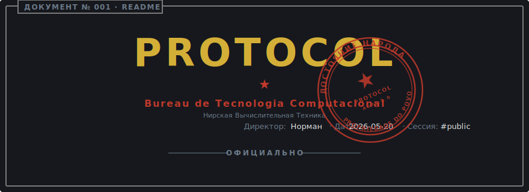

<!-- markdownlint-disable MD041 MD013 -->

<p align="center">
  <a href="README.md">
    
  </a>
</p>

<p align="center">
  <a href="https://github.com/niltonfrederico/glory-to-protocol/actions/workflows/ci.yml"></a>
  <a href="https://pypi.org/project/glory-to-protocol/"></a>
  <a href="https://pypi.org/project/glory-to-protocol/"></a>
  <a href="LICENSE"></a>
</p>

<p align="center">
  
</p>

## СВОДКА · Resumo

Uma biblioteca Python TUI pra CLIs em [Typer](https://typer.tiangolo.com/) que
veste seus comandos numa estética estatal-burocrática sem ironia — formulários
emoldurados, quatro carimbos de decisão (`approve` / `reject` / `order` /
`review`), `--help` tematizado, header com logo ASCII, e ticker ao vivo de
jobs em background.

`0.3.0` adiciona a facade `Protocol`, o decorator de paleta `@expose`, e um
caminho de fallback renderizado em Rich. O shell Textual (superfície
interativa completa) entra em `0.4.0` atrás do extra opcional `[tui]`.

<p align="center">
  
</p>

## Instalação

```bash
pip install glory-to-protocol
# ou
uv add glory-to-protocol
# ou
poetry add glory-to-protocol
```

## Quickstart de 30 segundos

```python
import typer
from glory_to_protocol import configure, make_app
from glory_to_protocol.tui.forms import Form
from glory_to_protocol.tui.stamps import stamp_approve

configure(app_name="MyBureau", logo_text="MyBureau", small_logo_text="MyBureau")
app = make_app()

@app.command()
def status() -> None:
    with Form(title="status") as form:
        form.line("Todos os sistemas nominais.")
        form.stamp(stamp_approve("status check", "auditoria limpa"))
```

Rode com `python my_cli.py status`. Pra caminhada guiada, veja
[**docs/tutorials/quickstart.pt-br.md**](docs/tutorials/quickstart.pt-br.md).

## АРХИВ · Documentação

O arquivo completo do bureau vive em [`docs/`](docs/README.pt-br.md), separado
por intenção:

| Estante | Quando abrir |
| --- | --- |
| [Tutorial: quickstart](docs/tutorials/quickstart.pt-br.md) | Primeiro contato. Caminhada de dez minutos. |
| [How-to: modo fallback](docs/how-to/use-fallback-mode.pt-br.md) | Plugue `Protocol` + `Mode` + `@expose` na sua CLI. |
| [Referência: settings](docs/reference/settings.pt-br.md) | Todo campo de `ProtocolSettings`, com overrides por env var. |
| [Referência: componentes](docs/reference/components.pt-br.md) | `Form`, logo, theme, stamps. Assinaturas e tabelas. |
| [Referência: jobs](docs/reference/jobs.pt-br.md) | `JobRunner`, `PipelineRunner`, callbacks, guard-rails. |
| [Explicação: modos de dispatch](docs/explanation/dispatch-modes.pt-br.md) | Por que `Mode` e `Fallback` são eixos separados; a capability check. |

## Status

**Beta (0.3.0).** A superfície pública é estável o bastante pra dirigir CLIs
de verdade (194 testes, ~98% de coverage). Minor versions ainda podem refinar
APIs antes do 1.0.

Planejado:

- `0.4.0` — Shell Textual atrás do extra `[tui]`, atalhos de paleta.
- `0.5.0+` — Integração com `JobsTicker` / `LogTail` ao vivo, injeção de tema,
  i18n.

Quer um favor do Верховный Лидер (Líder Supremo)?
[Abra uma issue](https://github.com/niltonfrederico/glory-to-protocol/issues/new).

## ОТКАЗ · Isenção

A estética visual e temática do projeto é inspirada livremente em
[Papers, Please](https://papersplea.se/) (© Lucas Pope / 3909 LLC),
especificamente na evocação de um bureau estatal fictício de tipo
Leste-Europeu.

A inspiração é apenas atmosférica. **Glory to Protocol não usa, referencia ou
distribui código, asset, artwork, personagem, nome, país ou marca de Papers,
Please.** Nenhum conteúdo de Arstotzka — ou de qualquer outro elemento
fictício do jogo — aparece neste repositório. O bureau, sua nomenclatura,
seus símbolos e sua linguagem são originais deste projeto.

Papers, Please e Arstotzka são propriedade de seus respectivos donos. Este
projeto não é afiliado, endossado ou patrocinado por Lucas Pope ou 3909 LLC.

Se a atmosfera deste projeto ressoa com você, considere apoiar o criador
original comprando Papers, Please no
[site oficial](https://papersplea.se/) ou na sua loja preferida.

## Registros do bureau

- [ВКЛАД · Contribuição](CONTRIBUTING.pt-br.md)
  - [Для граждан повышенного допуска · Para cidadãos de alta patente](TRUE_CONTRIBUTING.pt-br.md)
- [КОДЕКС · Código de Conduta](CODE_OF_CONDUCT.pt-br.md)
  - [Для граждан повышенного допуска · Para cidadãos de alta patente](TRUE_CODE_OF_CONDUCT.pt-br.md)
- [ЛИЦЕНЗИЯ · Licença](LICENSE)
