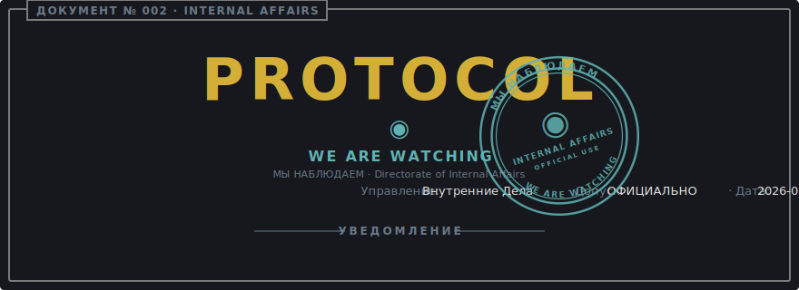
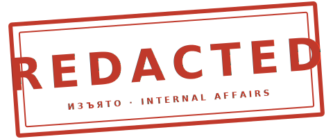

<p align="center">
  
</p>

# True Code of Conduct

> "You bet your ass we're all alike."
> — The Mentor, [*The Hacker Manifesto*](https://phrack.org/issues/7/3)

```
┌──────────────────────────────────────────────────────────────────────────┐
│ ДОКУМЕНТ № ........: 002                                                 │
│ TITLE ..............: True Code of Conduct (Истинный Кодекс Поведения)   │
│ CLASSIFICATION .....: OFFICIAL USE · DECLASSIFIED FOR PUBLIC POSTING     │
│ DIRECTORATE ........: Internal Affairs (Управление Внутренних Дел)       │
│ SUPERSEDES .........: CODE_OF_CONDUCT.md (cosmetic surface only)         │
│ APPROVED BY ........: Director Norman                                    │
│ COUNTERSIGNED ......: Supreme Gensek of the Supreme Party Vector         │
│ EFFECTIVE DATE .....: 2026-05-20                                         │
│ REVIEW CYCLE .......: PERPETUAL                                          │
└──────────────────────────────────────────────────────────────────────────┘
```

## Preamble

The public-facing [Code of Conduct](CODE_OF_CONDUCT.md) is a polite document.
It is also accurate. Every word of it holds. What follows is the same document
written without the polite varnish, for the benefit of contributors who prefer
the operational form over the diplomatic one.

Where the two documents disagree on tone, the public one wins for citation.
Where they disagree on **enforcement**, this one does.

## Section I — Jurisdiction

```
┌──────────────────────────────────────────────────────────────────────────┐
│ FIELD ..............: VALUE                                              │
│ ──────────────────────────────────────────────────────────────────────── │
│ Premises ...........: this repository, its issue tracker, its            │
│                       discussions, its pull request threads, and any     │
│                       inbound channel addressed to the maintainer        │
│                       regarding it                                       │
│ Subject persons ....: every individual who opens an issue, submits a     │
│                       patch, comments in review, or reads this document  │
│                       and proceeds anyway                                │
│ Effective scope ....: from your first interaction onward, retroactive    │
│                       to any prior interaction the Directorate elects    │
│                       to reexamine                                       │
└──────────────────────────────────────────────────────────────────────────┘
```

The Directorate of Internal Affairs is empowered by the Supreme Gensek to
exercise full disciplinary authority within these premises. There is no
appeal body above the Directorate; the Gensek does not adjudicate
contributor conduct personally.

## Section II — The Watching

The Directorate sees everything that touches the repository. This is not
metaphor and it is not surveillance theater. Git is a content-addressed log
of every byte you have ever submitted, signed against your identity, and
mirrored to every clone. Issues and reviews are permanent. Edits leave audit
trails. Deletions leave audit trails of the deletions.

Conduct yourself accordingly. We are watching not because we distrust you,
but because the medium itself records.

> **МЫ НАБЛЮДАЕМ.** *WE ARE WATCHING.*

## Section III — Conduct Becoming a Citizen

A contributor in good standing with the Directorate:

- Treats other contributors as colleagues whose time is worth as much as their own
- Argues the technical merit, never the person
- Files concerns through the proper channel — issue, review comment, or direct mail to the maintainer
- Accepts that the maintainer's no is a no, and that the door is not the failure

## Section IV — Conduct Subject to Correction

The following are addressed through the [Enforcement Ladder][ladder]:

- Sexualized speech, imagery, or solicitation, of any temperature
- Trolling, sneering, and the rhetorical posture of "just asking questions"
- Personal attacks dressed as critique
- Harassment, public or private, including pile-ons coordinated elsewhere
- Disclosure of another person's address, employer, real name, or other
  identifying detail without their prior written consent
- Conduct that would embarrass the contributor's own grandmother

## Section V — Conduct Not Subject to Correction

The Directorate maintains a list of behaviors for which the corrective ladder
**does not apply**. A single substantiated instance triggers immediate
sanction under Step 4. There is no warning, no remediation period, no
mediated conversation, and no second contact.

```
┌──────────────────────────────────────────────────────────────────────────┐
│ ARTICLE ............: PROHIBITED CONDUCT                                 │
│ ──────────────────────────────────────────────────────────────────────── │
│ V.1 ................: Ageism                                             │
│ V.2 ................: Homophobia                                         │
│ V.3 ................: Transphobia, including misgendering or             │
│                       deadnaming after correction                        │
│ V.4 ................: Racism, including slurs, "jokes," and dog-whistles │
│ V.5 ................: Xenophobia, including nationalist hostility        │
│ V.6 ................: Ableism — slurs targeting disability,              │
│                       neurodivergence, or mental health; claims that     │
│                       any class of people is intellectually inferior     │
│ V.7 ................: Misogyny and sex-based harassment                  │
│ V.8 ................: Antisemitism, Islamophobia, religious hatred       │
│ V.9 ................: Casteism                                           │
│ V.10 ...............: Fatphobia and body-based harassment                │
│ V.11 ...............: Advocacy of violence against any of the above      │
└──────────────────────────────────────────────────────────────────────────┘
```

Director Norman holds, on the authority of personal experience he does not
care to discuss in this document, that there is no operational position
under which any of the above improves a software project. The matter is not
open for debate within these premises.

The Directorate notes, for the record, that "devil's advocate" is not a
recognized legal status under Bureau procedure. The devil employs counsel
on retainer.

## Section VI — Enforcement Ladder
[ladder]: #section-vi--enforcement-ladder

```
┌──────────────────────────────────────────────────────────────────────────┐
│ STEP ...............: SANCTION                                           │
│ ──────────────────────────────────────────────────────────────────────── │
│ 1 — Correction .....: Private written notice from the Directorate.      │
│                       A public apology may be required as a condition    │
│                       of further participation.                          │
│ 2 — Warning ........: Formal warning. Bilateral no-contact order with    │
│                       affected parties for a stated period.              │
│ 3 — Temporary Ban ..: Revocation of repository access for a stated       │
│                       period. No public or private interaction with      │
│                       affected parties during the period.                │
│ 4 — Permanent Ban ..: Permanent revocation. Issued for sustained         │
│                       violation, harassment of an individual, hostility  │
│                       toward a class of persons, or any single instance  │
│                       of conduct under Section V.                        │
└──────────────────────────────────────────────────────────────────────────┘
```

## Section VII — Reporting Procedure

```
┌──────────────────────────────────────────────────────────────────────────┐
│ FIELD ..............: VALUE                                              │
│ ──────────────────────────────────────────────────────────────────────── │
│ Receiving officer ..: Maintainer of record                               │
│ Address ............: 9078708+niltonfrederico@users.noreply.github.com   │
│ Required form ......: Free-form. Permanent links to the offending        │
│                       artifact (issue, comment, commit) preferred.       │
│ Acknowledgement ....: Within a reasonable interval. Bureau does not      │
│                       publish a service-level agreement on emotional     │
│                       labor.                                             │
│ Confidentiality ....: The reporter's identity is sealed. Disclosure to   │
│                       the accused is not made as a matter of policy.     │
└──────────────────────────────────────────────────────────────────────────┘
```

The Directorate will not adjudicate disputes that occurred outside these
premises. The Directorate may, however, **consider** outside conduct when
weighing the credibility of a report filed about conduct that did occur here.

## Section VIII — About the Rubber Duct

<p align="center">
  
</p>

## Attribution

This document is the operational sibling of [CODE_OF_CONDUCT.md](CODE_OF_CONDUCT.md),
which is adapted from the
[cumbuca.dev Code of Conduct](https://github.com/cumbucadev/contributions/blob/main/CODE_OF_CONDUCT_EN.md)
and the [Contributor Covenant 2.1](https://www.contributor-covenant.org/version/2/1/code_of_conduct.html).
The enforcement ladder traces back to [Mozilla's enforcement ladder](https://github.com/mozilla/diversity).
The opening epigraph is from *The Hacker Manifesto* by The Mentor,
[Phrack, Volume One, Issue 7, Phile 3 of 10 (1986)](https://phrack.org/issues/7/3).

> **Слава НИРВЫТЕХ. Слава Генсеку.**
