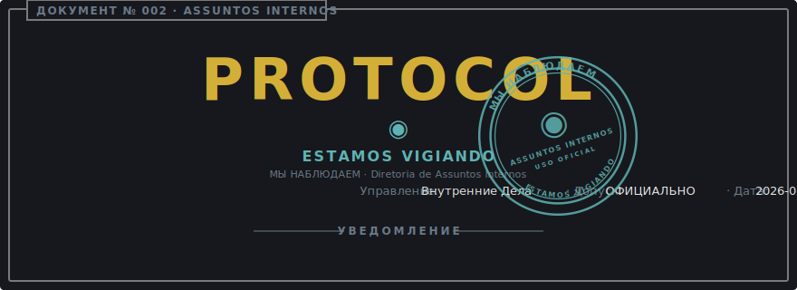
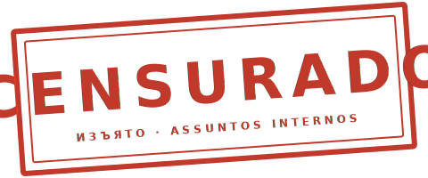

<p align="center">
  <a href="TRUE_CODE_OF_CONDUCT.md">
    
  </a>
</p>

<p align="center">
  
</p>

# Verdadeiro Código de Conduta

> "Pode apostar a sua bunda que somos todos iguais."
> — The Mentor, [*The Hacker Manifesto*](https://phrack.org/issues/7/3)

```
┌──────────────────────────────────────────────────────────────────────────┐
│ ДОКУМЕНТ № ........: 002                                                 │
│ TÍTULO .............: Verdadeiro Código de Conduta                       │
│                       (Истинный Кодекс Поведения)                        │
│ CLASSIFICAÇÃO ......: USO OFICIAL · DECLASSIFICADO PARA AFIXAÇÃO PÚBLICA │
│ DIRETORIA ..........: Assuntos Internos (Управление Внутренних Дел)      │
│ SUPERA .............: CODE_OF_CONDUCT.pt-br.md (apenas superfície)       │
│ APROVADO POR .......: Diretor Norman                                     │
│ REFERENDADO POR ....: Genseco Supremo do Vetor Partidário Supremo        │
│ DATA DE VIGÊNCIA ...: 2026-05-20                                         │
│ CICLO DE REVISÃO ...: PERPÉTUO                                           │
└──────────────────────────────────────────────────────────────────────────┘
```

## Preâmbulo

O [Código de Conduta](CODE_OF_CONDUCT.pt-br.md) público é um documento
educado. Também é preciso. Cada palavra dele se sustenta. O que se segue é
o mesmo documento escrito sem o verniz educado, em benefício de
contribuidores que preferem a forma operacional à diplomática.

Onde os dois documentos divergirem em tom, o público vence para fins de
citação. Onde divergirem em **aplicação**, este vence.

## Seção I — Jurisdição

```
┌──────────────────────────────────────────────────────────────────────────┐
│ CAMPO ..............: VALOR                                              │
│ ──────────────────────────────────────────────────────────────────────── │
│ Dependências .......: este repositório, seu rastreador de issues, suas   │
│                       discussions, suas threads de pull request, e       │
│                       qualquer canal de entrada endereçado ao            │
│                       mantenedor a respeito dele                         │
│ Pessoas sujeitas ...: todo indivíduo que abre uma issue, submete um      │
│                       patch, comenta em review, ou lê este documento e   │
│                       prossegue assim mesmo                              │
│ Escopo de vigência .: a partir da sua primeira interação, retroativo a   │
│                       qualquer interação anterior que a Diretoria eleja  │
│                       reexaminar                                         │
└──────────────────────────────────────────────────────────────────────────┘
```

A Diretoria de Assuntos Internos é investida pelo Genseco Supremo do plena
autoridade disciplinar dentro destas dependências. Não há instância de
apelação acima da Diretoria; o Genseco não adjudica conduta de
contribuidor pessoalmente.

## Seção II — A Vigilância

A Diretoria vê tudo o que toca o repositório. Isso não é metáfora e não é
teatro de vigilância. Git é um log endereçado por conteúdo de cada byte
que você já submeteu, assinado contra sua identidade, e espelhado em cada
clone. Issues e reviews são permanentes. Edições deixam trilhas de
auditoria. Remoções deixam trilhas de auditoria das remoções.

Aja em conformidade. Estamos vigiando não porque desconfiamos de você,
mas porque o próprio meio registra.

> **МЫ НАБЛЮДАЕМ.** *ESTAMOS VIGIANDO.*

## Seção III — Conduta Própria de um Cidadão

Um contribuidor em situação regular com a Diretoria:

- Trata os demais contribuidores como colegas cujo tempo vale tanto quanto o seu
- Argumenta o mérito técnico, nunca a pessoa
- Apresenta preocupações pelo canal apropriado — issue, comentário de review, ou correspondência direta ao mantenedor
- Aceita que o não do mantenedor é não, e que a porta não é o fracasso

## Seção IV — Conduta Sujeita a Correção

As seguintes são endereçadas pela [Escada de Aplicação][escada]:

- Fala, imagem ou solicitação sexualizada, de qualquer temperatura
- Trollagem, escárnio e a postura retórica do "só estou perguntando"
- Ataques pessoais vestidos de crítica
- Assédio, público ou privado, incluindo pile-ons coordenados em outros lugares
- Divulgação do endereço, empregador, nome real ou outro dado
  identificador de outra pessoa sem consentimento prévio por escrito
- Conduta que envergonharia a própria avó do contribuidor

## Seção V — Conduta Não Sujeita a Correção

A Diretoria mantém uma lista de condutas para as quais a escada corretiva
**não se aplica**. Uma única instância substantiada dispara sanção
imediata sob o Passo 4. Não há aviso, não há prazo de remediação, não há
conversa mediada, e não há segundo contato.

```
┌──────────────────────────────────────────────────────────────────────────┐
│ ARTIGO .............: CONDUTA PROIBIDA                                   │
│ ──────────────────────────────────────────────────────────────────────── │
│ V.1 ................: Etarismo                                           │
│ V.2 ................: Homofobia                                          │
│ V.3 ................: Transfobia, incluindo misgendering ou deadnaming   │
│                       após correção                                      │
│ V.4 ................: Racismo, incluindo slurs, "piadas" e dog-whistles  │
│ V.5 ................: Xenofobia, incluindo hostilidade nacionalista      │
│ V.6 ................: Capacitismo — slurs voltados a deficiência,        │
│                       neurodivergência ou saúde mental; afirmações de    │
│                       que qualquer classe de pessoas seja                │
│                       intelectualmente inferior                          │
│ V.7 ................: Misoginia e assédio sexista                        │
│ V.8 ................: Antissemitismo, islamofobia, ódio religioso        │
│ V.9 ................: Castismo                                           │
│ V.10 ...............: Gordofobia e assédio baseado em corpo              │
│ V.11 ...............: Apologia à violência contra qualquer dos acima     │
└──────────────────────────────────────────────────────────────────────────┘
```

O Diretor Norman sustenta, na autoridade de experiência pessoal que ele
não tem interesse em discutir neste documento, que não há posição
operacional sob a qual qualquer das condutas acima melhore um projeto de
software. A questão não está aberta a debate dentro destas dependências.

A Diretoria registra, para constar, que "advogado do diabo" não é figura
jurídica reconhecida em procedimento do Bureau. O diabo apenas advoga sob consultoria privada.

## Seção VI — Escada de Aplicação

[escada]: #seção-vi--escada-de-aplicação

```
┌──────────────────────────────────────────────────────────────────────────┐
│ PASSO ..............: SANÇÃO                                             │
│ ──────────────────────────────────────────────────────────────────────── │
│ 1 — Correção .......: Notificação privada por escrito da Diretoria.      │
│                       Um pedido público de desculpas pode ser exigido    │
│                       como condição para participação subsequente.       │
│ 2 — Advertência ....: Advertência formal. Ordem bilateral de não-contato │
│                       com partes afetadas por período determinado.       │
│ 3 — Banim. Temp. ...: Revogação de acesso ao repositório por período     │
│                       determinado. Sem interação pública ou privada com  │
│                       partes afetadas durante o período.                 │
│ 4 — Banim. Perm. ...: Revogação permanente. Emitida em violação          │
│                       sustentada, assédio a um indivíduo, hostilidade a  │
│                       uma classe de pessoas, ou qualquer instância       │
│                       isolada de conduta sob a Seção V.                  │
└──────────────────────────────────────────────────────────────────────────┘
```

## Seção VII — Procedimento de Reporte

```
┌──────────────────────────────────────────────────────────────────────────┐
│ CAMPO ..............: VALOR                                              │
│ ──────────────────────────────────────────────────────────────────────── │
│ Oficial receptor ...: Mantenedor de registro                             │
│ Endereço ...........: 9078708+niltonfrederico@users.noreply.github.com   │
│ Forma requerida ....: Livre. Links permanentes ao artefato infrator      │
│                       (issue, comentário, commit) são preferidos.        │
│ Reconhecimento .....: Em intervalo razoável. O Bureau não publica SLA    │
│                       sobre trabalho emocional.                          │
│ Confidencialidade ..: A identidade de quem reporta é selada. Divulgação  │
│                       ao acusado não é feita por política.               │
└──────────────────────────────────────────────────────────────────────────┘
```

A Diretoria não adjudicará disputas ocorridas fora destas dependências. A
Diretoria pode, no entanto, **considerar** conduta externa ao pesar a
credibilidade de um reporte arquivado sobre conduta que de fato ocorreu
aqui.

## Seção VIII — Sobre o Pato de Borracha

<p align="center">
  
</p>

## Atribuição

Este documento é o irmão operacional de
[CODE_OF_CONDUCT.pt-br.md](CODE_OF_CONDUCT.pt-br.md), que é adaptado do
[Código de Conduta da cumbuca.dev](https://github.com/cumbucadev/contributions/blob/main/CODE_OF_CONDUCT.md)
e do [Contributor Covenant 2.1](https://www.contributor-covenant.org/version/2/1/code_of_conduct.html).
A escada de aplicação remonta à
[escada de aplicação da Mozilla](https://github.com/mozilla/diversity).
A epígrafe de abertura é de *The Hacker Manifesto* de The Mentor,
[Phrack, Volume One, Issue 7, Phile 3 of 10 (1986)](https://phrack.org/issues/7/3).

> **Слава НИРВЫТЕХ. Слава Генсеку.**
