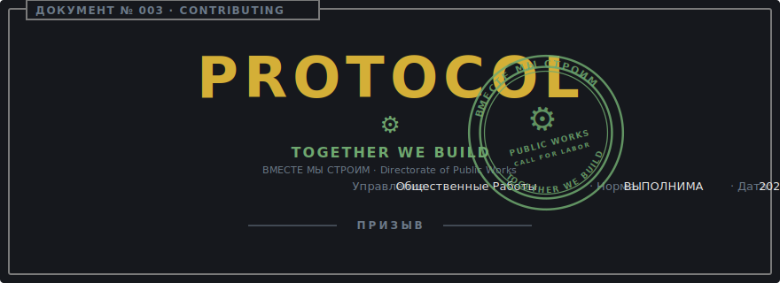
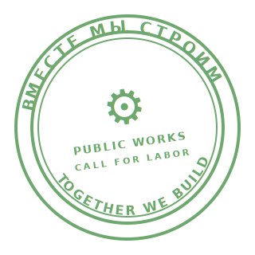

<p align="center">
  <a href="TRUE_CONTRIBUTING.pt-br.md">
    
  </a>
</p>

<p align="center">
  
</p>

# True Contributing Guide

> "Together we build."
> — Directorate of Public Works, posted at every shift change.

```
┌──────────────────────────────────────────────────────────────────────────┐
│ ДОКУМЕНТ № ........: 003                                                 │
│ TITLE ..............: True Contributing Guide                            │
│                       (Истинное Руководство по Вкладу)                   │
│ CLASSIFICATION .....: OPEN CALL · POSTED IN PUBLIC SQUARES               │
│ DIRECTORATE ........: Public Works (Общественные Работы)                 │
│ COMPANION ..........: CONTRIBUTING.md (operational sibling)              │
│ APPROVED BY ........: Director Norman                                    │
│ COUNTERSIGNED ......: Supreme Gensek of the Supreme Party Vector         │
│ EFFECTIVE DATE .....: 2026-05-20                                         │
└──────────────────────────────────────────────────────────────────────────┘
```

## Preamble

This is the same guidance as [CONTRIBUTING.md](CONTRIBUTING.md), translated
into Bureau voice for citizens who prefer the form over the summary. Where
the two diverge on substance, the public document holds — but the substance
is, in fact, the same.

The Directorate welcomes labor. The Directorate is also picky about it.

## Article I — Prior Reading

Every contributor presenting themselves at the gate has first read the
[Code of Conduct](CODE_OF_CONDUCT.md), with particular attention to its
[Section on Conduct Not Subject to Correction](TRUE_CODE_OF_CONDUCT.md#section-v--conduct-not-subject-to-correction).
The Directorate of Internal Affairs is not on a different floor; it is in
the same building, watching the same hallway.

## Article II — Every Work Order Begins as a Filed Concern

```
┌──────────────────────────────────────────────────────────────────────────┐
│ FIELD ..............: VALUE                                              │
│ ──────────────────────────────────────────────────────────────────────── │
│ Required artifact ..: A filed issue, opened **before** the patch.        │
│ Scope per work order: One. A patch addresses a single filed concern;     │
│                       refactors are not smuggled in alongside features.  │
│ Drive-by patches ...: Returned at the gate with instructions to file the │
│                       corresponding concern first. The Bureau does not   │
│                       review unannounced material.                       │
└──────────────────────────────────────────────────────────────────────────┘
```

The point is not paperwork for paperwork's sake. The point is that **the
shape of the change is debated before the labor is spent.** A patch nobody
agreed to is a patch nobody can merge.

## Article III — Standards of Workmanship

A patch is fit for review when every line of the following holds:

```
┌──────────────────────────────────────────────────────────────────────────┐
│ CHECK ..............: REQUIRED STATE                                     │
│ ──────────────────────────────────────────────────────────────────────── │
│ pre-commit .........: `uv run pre-commit run --all-files` clean.         │
│                       (covers lint, format, type check, dead fixtures,   │
│                       and markdown.)                                     │
│ Test suite .........: Passes in full.                                    │
│ Coverage ...........: Does not regress.                                  │
│ Test names .........: `test_should_{expected}_when_{condition}`.         │
└──────────────────────────────────────────────────────────────────────────┘
```

A check that fails for reasons unrelated to the patch is **disclosed**, not
disabled. The Bureau does not accept silently muted alarms.

## Article IV — On Mechanical Labor (AI Assistance)

The Directorate maintains no position against the use of AI tooling. The
Director used it intensively in the construction of this very Bureau.
Pretending otherwise would be undignified.

The Directorate maintains the following position **for** AI tooling:

```
┌──────────────────────────────────────────────────────────────────────────┐
│ DOCTRINE ...........: AI-ASSISTED, NOT VIBE-CODED.                       │
└──────────────────────────────────────────────────────────────────────────┘
```

Concretely:

- The contributor reads the diff before submission. If a line cannot be
  explained, it does not ship.
- The contributor understands the test. Tests generated and unread cause
  measurably more damage than absent tests.
- The contributor owns the code. *"The model wrote it"* is not a recognized
  defense at review.

Patches with the shape of unread output are returned at the gate with the
instruction to read them and resubmit.

## Article V — Reuse Before Duplication

Before constructing a new helper, the contributor surveys the existing
codebase for the helper that already exists, or that almost does. Extension
and refactor of the present thing take precedence over the introduction of
a parallel thing. Duplication is the more expensive choice over the life
of the works.

The Directorate cites two foundational documents of the Python civil code:

- **[PEP 8](https://peps.python.org/pep-0008/)** — *"code is read much more
  often than it is written."* Layout and naming exist because the next
  reader pays the cost.
- **[PEP 20, the Zen of Python](https://peps.python.org/pep-0020/)** —
  particularly *"There should be one — and preferably only one — obvious
  way to do it"* and *"Sparse is better than dense."*

Three similar lines is not duplication. Three near-identical functions is.

## Article VI — Submission of the Work Order

```
┌──────────────────────────────────────────────────────────────────────────┐
│ FIELD ..............: VALUE                                              │
│ ──────────────────────────────────────────────────────────────────────── │
│ Linked concern .....: The originating issue, by number.                  │
│ Justification ......: Two or three sentences. The **why**, never a       │
│                       recapitulation of the diff. The diff speaks for    │
│                       itself.                                            │
│ Deferred items .....: Any follow-up work consciously left for later,     │
│                       noted by the contributor on submission.            │
└──────────────────────────────────────────────────────────────────────────┘
```

## Closing

<p align="center">
  
</p>

The Bureau builds nothing alone. Welcome to the labor.

> **ВМЕСТЕ МЫ СТРОИМ. Слава Генсеку.**
