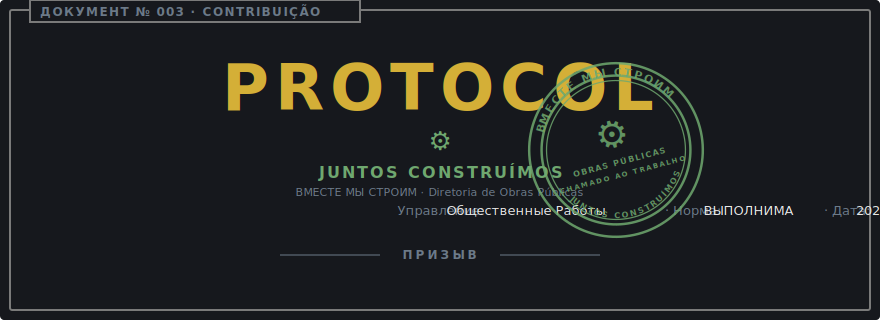

<p align="center">
  <a href="TRUE_CONTRIBUTING.md">
    
  </a>
</p>

<p align="center">
  
</p>

# Verdadeiro Guia de Contribuição

> "Juntos construímos."
> — Diretoria de Obras Públicas, afixado a cada troca de turno.

```
┌──────────────────────────────────────────────────────────────────────────┐
│ ДОКУМЕНТ № ........: 003                                                 │
│ TÍTULO .............: Verdadeiro Guia de Contribuição                    │
│                       (Истинное Руководство по Вкладу)                   │
│ CLASSIFICAÇÃO ......: CHAMADO ABERTO · AFIXADO EM PRAÇAS PÚBLICAS        │
│ DIRETORIA ..........: Obras Públicas (Общественные Работы)               │
│ COMPANHEIRO ........: CONTRIBUTING.pt-br.md (irmão operacional)          │
│ APROVADO POR .......: Diretor Norman                                     │
│ REFERENDADO POR ....: Genseco Supremo do Vetor Partidário Supremo        │
│ DATA DE VIGÊNCIA ...: 2026-05-20                                         │
└──────────────────────────────────────────────────────────────────────────┘
```

## Preâmbulo

Esta é a mesma orientação de [CONTRIBUTING.pt-br.md](CONTRIBUTING.pt-br.md),
traduzida para a voz do Bureau, em benefício de cidadãos que preferem a
forma ao sumário. Onde as duas divergirem em substância, o documento
público vale — mas a substância é, de fato, a mesma.

A Diretoria acolhe trabalho. A Diretoria também é exigente quanto a ele.

## Artigo I — Leitura Prévia

Todo contribuidor que se apresenta ao portão leu primeiro o
[Código de Conduta](CODE_OF_CONDUCT.pt-br.md), com atenção particular à sua
[Seção sobre Conduta Não Sujeita a Correção](TRUE_CODE_OF_CONDUCT.pt-br.md#seção-v--conduta-não-sujeita-a-correção).
A Diretoria de Assuntos Internos não fica em outro andar; fica no mesmo
prédio, vigiando o mesmo corredor.

## Artigo II — Toda Ordem de Serviço Começa como Preocupação Arquivada

```
┌──────────────────────────────────────────────────────────────────────────┐
│ CAMPO ..............: VALOR                                              │
│ ──────────────────────────────────────────────────────────────────────── │
│ Artefato exigido ...: Uma issue arquivada, aberta **antes** do patch.    │
│ Escopo por ordem ...: Um. Um patch endereça uma única preocupação        │
│                       arquivada; refactors não são contrabandeados       │
│                       junto com features.                                │
│ Patches drive-by ...: Devolvidos no portão com instruções para arquivar  │
│                       primeiro a preocupação correspondente. O Bureau    │
│                       não revisa material não anunciado.                 │
└──────────────────────────────────────────────────────────────────────────┘
```

O ponto não é papelada por papelada. O ponto é que **a forma da mudança é
debatida antes de o trabalho ser gasto.** Um patch com o qual ninguém
concordou é um patch que ninguém pode dar merge.

## Artigo III — Padrões de Execução

Um patch está apto a review quando cada linha do seguinte se sustenta:

```
┌──────────────────────────────────────────────────────────────────────────┐
│ VERIFICAÇÃO ........: ESTADO EXIGIDO                                     │
│ ──────────────────────────────────────────────────────────────────────── │
│ Suíte de testes ....: Passa integralmente.                               │
│ Cobertura ..........: Não regride.                                       │
│ `ruff format` ......: Limpo.                                             │
│ `ruff check` .......: Limpo.                                             │
│ `ty` (type check) ..: Limpo.                                             │
│ Nomes de teste .....: `test_should_{expected}_when_{condition}`.         │
└──────────────────────────────────────────────────────────────────────────┘
```

Uma verificação que falhe por razão não relacionada ao patch é
**declarada**, não desabilitada. O Bureau não aceita alarmes silenciados
em surdina.

## Artigo IV — Sobre o Trabalho Mecânico (Assistência de IA)

A Diretoria não mantém posição contrária ao uso de ferramentas de IA. O
Diretor as usou intensamente na construção deste mesmo Bureau. Fingir o
contrário seria indigno.

A Diretoria mantém a seguinte posição **a favor** de ferramentas de IA:

```
┌──────────────────────────────────────────────────────────────────────────┐
│ DOUTRINA ...........: AI-ASSISTED, NÃO VIBE-CODED.                       │
└──────────────────────────────────────────────────────────────────────────┘
```

Concretamente:

- O contribuidor lê o diff antes da submissão. Se uma linha não pode ser
  explicada, ela não embarca.
- O contribuidor entende o teste. Testes gerados e não lidos causam dano
  mensuravelmente maior do que ausência de testes.
- O contribuidor assume o código. *"O modelo escreveu"* não é defesa
  reconhecida em review.

Patches com a cara de saída não-lida são devolvidos no portão com a
instrução de lê-los e resubmeter.

## Artigo V — Reuso Antes da Duplicação

Antes de construir um novo helper, o contribuidor vistoria o codebase
existente em busca do helper que já existe, ou que quase existe. Extensão
e refactor da coisa presente têm precedência sobre a introdução de uma
coisa paralela. Duplicação é a escolha mais cara ao longo da vida das
obras.

A Diretoria cita dois documentos fundadores do código civil Python:

- **[PEP 8](https://peps.python.org/pep-0008/)** — *"código é lido muito
  mais do que é escrito."* Layout e nomenclatura existem porque o próximo
  leitor é quem paga o custo.
- **[PEP 20, o Zen do Python](https://peps.python.org/pep-0020/)** —
  particularmente *"Deveria haver uma — e preferencialmente apenas uma —
  maneira óbvia de fazer isso"* e *"Esparso é melhor que denso."*

Três linhas parecidas não é duplicação. Três funções quase idênticas é.

## Artigo VI — Submissão da Ordem de Serviço

```
┌──────────────────────────────────────────────────────────────────────────┐
│ CAMPO ..............: VALOR                                              │
│ ──────────────────────────────────────────────────────────────────────── │
│ Preocupação linkada : A issue de origem, por número.                     │
│ Justificativa ......: Duas ou três frases. O **porquê**, nunca uma       │
│                       recapitulação do diff. O diff fala por si.         │
│ Itens diferidos ....: Qualquer trabalho de follow-up conscientemente     │
│                       deixado para depois, anotado pelo contribuidor na  │
│                       submissão.                                         │
└──────────────────────────────────────────────────────────────────────────┘
```

## Encerramento

<p align="center">
  
</p>

O Bureau nada constrói sozinho. Bem-vindo(a) ao trabalho.

> **ВМЕСТЕ МЫ СТРОИМ. Слава Генсеку.**
